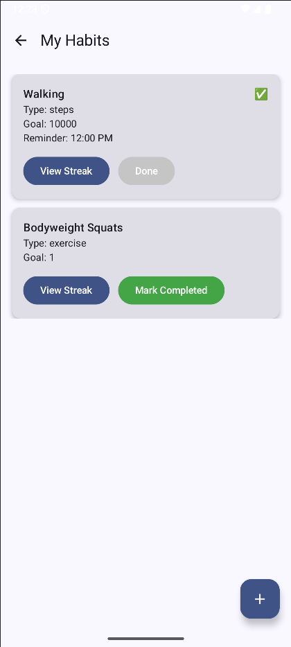
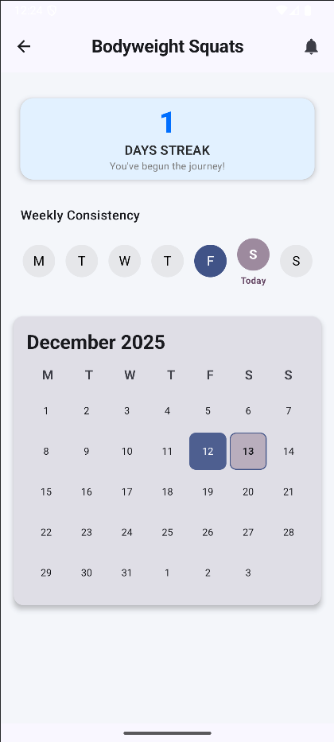
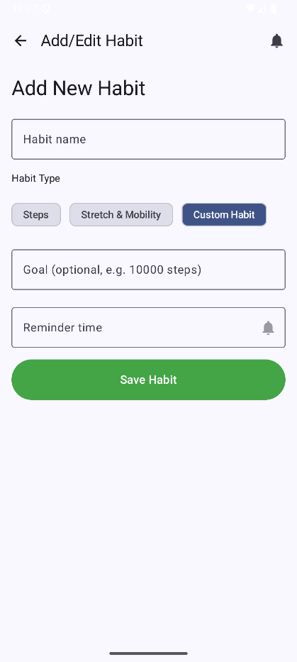
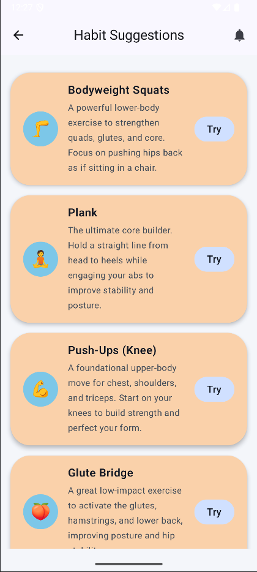
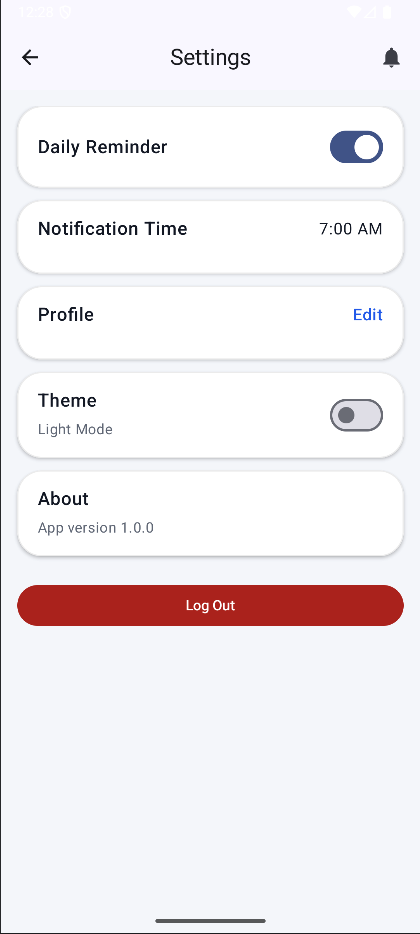

# Fitness Habit Builder

**Disclosure:** *This app was created for CS 639 Mobile App Development at Pace University in Fall 2025.*


## Team
- [Daniel](https://github.com/dfox131)
- [Siming](https://github.com/leolub)
- [Sarvesh](https://github.com/sarvesh-shah)

## About The App
Fitness Habit Builder is designed to help users establish and maintain healthy routines through consistent tracking and positive reinforcement. Whether you are trying to build a running habit, drink more water, or complete daily workouts, this app allows you to track your progress visually. 

With features like streak tracking, dark mode support, and intelligent workout suggestions powered by external APIs, Fitness Habit Builder keeps you motivated and accountable.


## Install App
[ Download Fitness Habit Builder (APK)](#) *(add link)*

## Idea Proposal
We provided one concept for the app in this proposal.  
[Access the full document](https://paceuniversity-my.sharepoint.com/:w:/g/personal/df99571n_pace_edu/ESQdGi8iG9FOn2m03H9WupcBuQvT-3IZGW5cgzL39_ba8g?e=Vm4lcU)

## Design
You can view the full UI/UX design and Database schema of this app:
- [Figma Prototype](https://www.figma.com/design/dFV5TPc9RhQ5yhaU15LsYM/Fitness-Habit-Builder?node-id=0-1&t=cxMXaUuI5Hl8b9gv-1)
- [Database Design Document](https://paceuniversity-my.sharepoint.com/:w:/g/personal/df99571n_pace_edu/Eb3hxrGZX8RBvERSvCNKvDIBEmcfWy6QTzHx773rLmYZsQ?e=HKmith)

## Main Features
- **Habit Management**: Create, edit, and delete custom fitness habits with specific goals.
- **Streak Tracker**: Visual streak counters and weekly progress views to encourage consistency.
- **Smart Suggestions**: Integration with Wger/API Ninjas to suggest new exercises based on muscle groups.
- **Cloud Synchronization**: Real-time data storage using Firebase Firestore, ensuring data persists across devices.
- **Dark Mode Support**: Seamless switching between Light and Dark themes for better user experience.
- **Health Integration**: Connects with Android Health Connect to sync step counts and activity data.

## Technologies
<table border="1" cellspacing="0" cellpadding="6">
  <tr>
    <th>Technology</th>
    <th>Used For</th>
    <th>Logic / How It Works</th>
  </tr>

  <tr>
    <td><b>Kotlin + Jetpack Compose</b></td>
    <td>UI and Business Logic</td>
    <td>Uses declarative UI to build screens; Kotlin Coroutines and Flow manage asynchronous data streams.</td>
  </tr>

  <tr>
    <td><b>Firebase Authentication</b></td>
    <td>User Management</td>
    <td>Handles secure user sign-up, sign-in, and maintains user sessions securely.</td>
  </tr>

  <tr>
    <td><b>Firebase Firestore</b></td>
    <td>Cloud Database</td>
    <td>Stores user habits, streak history, and profile settings in a NoSQL structure for real-time syncing.</td>
  </tr>

  <tr>
    <td><b>Wger / API Ninjas Exercise API</b></td>
    <td>Fitness Content</td>
    <td>Fetches external exercise data via Retrofit to populate the "Suggestions" screen with new workout ideas.</td>
  </tr>

  <tr>
    <td><b>Android Health Connect</b></td>
    <td>Health Data Integration</td>
    <td>Reads on-device health data (like steps) to automatically update relevant habits.</td>
  </tr>

  <tr>
    <td><b>Material Design 3</b></td>
    <td>UI Components</td>
    <td>Implements modern Android styling, including dynamic color schemes and accessible components.</td>
  </tr>
</table>

## 📸 Screenshots

<table>
  <tr>
    <td valign="top">
      
    </td>
    <td valign="top">
      
    </td>
    <td valign="top">
      
    </td>
  </tr>
  <tr>
    <td valign="top">
      
    </td>
    <td valign="top">
      
    </td>
    <td valign="top">
      
    </td>
  </tr>
</table>

## 🎥 Demo Video

[](https://youtube.com/shorts/WopNPM12W1M)

## GitHub Insights


## Learning Experience & Challenges
- **State Management**: Strengthened understanding of **ViewModel** and **StateFlow** to manage UI state effectively across multiple screens.
- **Asynchronous Programming**: Learned to handle complex asynchronous operations using **Kotlin Coroutines**, especially when syncing data between the local UI and Firebase Firestore.
- **API Integration**: Developed experience with **Retrofit** to parse JSON responses from external Fitness APIs and display them dynamically in Compose.
- **Complex UI Logic**: Overcame challenges in building the "Streak Tracker" logic, ensuring that streak counts calculate correctly based on calendar dates.
- **Navigation**: Implemented a robust navigation system using a Navigation Drawer and passing arguments (like `habitId`) between screens.

## Organization of Files
This project follows the **MVVM (Model-View-ViewModel)** architecture pattern:

```text
dev.pace.cs639project
├── data/                 # Data Layer (Repositories & Models)
│   ├── AuthRepository.kt
│   ├── FirestoreRepository.kt
│   ├── Habit.kt
│   ├── User.kt
│   └── ...
├── ui/                   # UI Layer (Compose Screens & Components)
│   ├── screens/
│   │   ├── HomeScreen.kt
│   │   ├── HabitListScreen.kt
│   │   ├── StreakTrackerScreen.kt
│   │   └── ...
│   ├── components/
│   │   ├── DailyProgressPieChart.kt
│   │   ├── StreakCalendar.kt
│   │   └── ...
│   └── theme/
├── viewmodel/            # Business Logic (State Holders)
│   ├── AuthViewModel.kt
│   ├── HomeViewModel.kt
│   ├── StreakTrackerViewModel.kt
│   └── ...
└── AppNavigation.kt      # Main Navigation Graph
└── MainActivity.kt